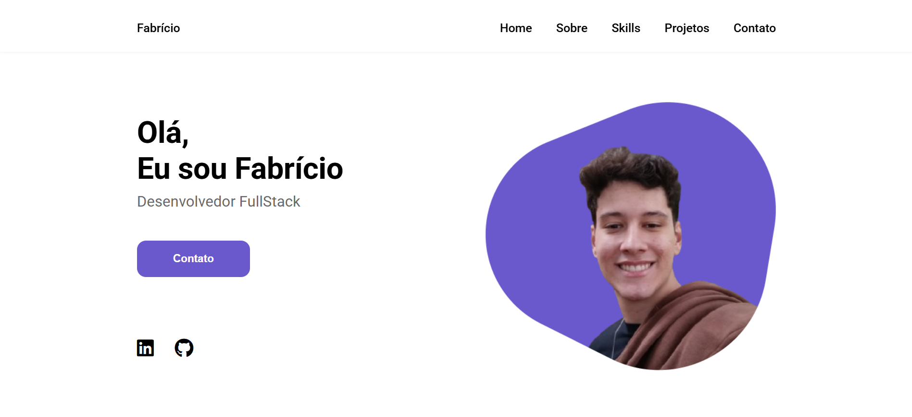

# 🌐 Meu Portfólio  

> Um site pessoal desenvolvido para demonstrar minhas habilidades, projetos e trajetória como desenvolvedor.  

## 🎨 Demonstração  
🔗 [Acesse meu portfólio aqui](https://fcdias0812.github.io/portfolio/)
📸 

## 🛠️ Tecnologias Utilizadas  
- HTML5  
- CSS3  

## ⚡ Seções do Portfólio  
✔️ **Home** – Apresentação inicial  
✔️ **Sobre** – Minha trajetória e habilidades  
✔️ **Projetos** – Lista de projetos desenvolvidos  
✔️ **Contato** – Formas de entrar em contato comigo  

## 📦 Como visualizar o projeto localmente  
```bash
# Clone o repositório
git clone https://github.com/fcdias0812/portfolio

# Acesse a pasta do projeto
cd portfolio

# Abra o arquivo index.html no navegador
```

## 🎯 Aprendizados  
Esse projeto foi desenvolvido com base nos ensinamentos do curso Fullstack do Sujeito Programador. Foi uma excelente experiência para reforçar conceitos fundamentais de HTML e CSS.  

## 🚀 Futuras Melhorias  
- [ ] Implementar JavaScript para mais interatividade
- [ ] Melhorar o design e estilização com React

## 📞 Contato  
📧 Email: dias.fabricio0812@email.com  
💼 LinkedIn: [Acesse meu LinkedIn](https://www.linkedin.com/in/fcdias0812/)  
👨🏻‍💻 devChallenges: [Acesse meu devChallenges](https://devchallenges.io/profile/ddc059be-9eb4-40fb-b8cd-6f8dcd32b468)
